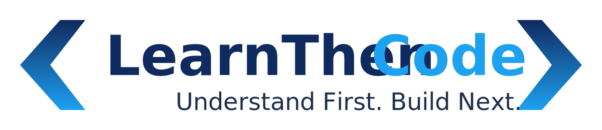

<p align="center">
  
</p>

<h1 align="center">LearnThenCode Curriculum</h1>

<p align="center">
  <strong>Understand First. Build Next.</strong>
</p>

# LearnThenCode Curriculum

Welcome to the official **LearnThenCode Curriculum** repository.

This repository contains the complete source curriculum for the LearnThenCode Full Stack Software Engineering Bootcamp. It serves as the single source of truth for curriculum documentation, lessons, coding labs, projects, and supporting educational resources.

The curriculum is designed to help aspiring software engineers build a strong foundation in software development through conceptual understanding, hands-on practice, mentorship, and real-world projects.

---

## Mission

**To equip learners with industry-relevant tech and communication skills through project-based learning, mentorship, and technology-driven education.**

---

## Philosophy

The philosophy is simple:

> **Master the fundamentals first, then build with purpose.**

This philosophy is reflected throughout the curriculum and reinforced by LearnThenCode's guiding principle:

> **Understand First. Build Next.**

Rather than encouraging learners to memorize syntax, the curriculum emphasizes understanding concepts, solving real-world problems, and developing the mindset of a professional software engineer.

---

## What Makes LearnThenCode Different?

The LearnThenCode curriculum is built around several core principles:

- Master the fundamentals before learning advanced technologies.
- Learn through hands-on practice and project-based learning.
- Develop professional software engineering habits from the beginning.
- Build communication, collaboration, and problem-solving skills alongside technical skills.
- Encourage curiosity, critical thinking, and continuous learning.

The goal is not simply to teach programming languages or frameworks, but to help learners understand how software is designed, built, tested, maintained, and continuously improved.

---

## Curriculum Structure

The curriculum is organized into progressive courses that guide learners from beginner to full stack software engineer.

1. Developer Foundations
2. Web Development
3. Programming with JavaScript
4. Frontend Engineering
5. Backend Engineering
6. Databases
7. Full Stack Engineering

Each course contains carefully structured lessons, sub-lessons, coding labs, and projects that build upon previously acquired knowledge.

---

## Learning Approach

Every lesson is designed to help learners:

- Understand the underlying concepts.
- Discover why technologies exist and the problems they solve.
- Explore real-world applications.
- Practice through guided examples.
- Reinforce learning with coding labs.
- Apply knowledge by building projects.

Throughout the bootcamp, learners complete mini-projects that progressively increase in complexity before culminating in a comprehensive capstone project that integrates the knowledge and skills developed throughout the program.

---

## Repository Structure

```text
learnthencode-curriculum/
│
├── documentation/
├── courses/
└── projects/
```

### `documentation/`

Contains curriculum-wide documentation, including:

- Teaching Philosophy
- Graduate Profile
- Curriculum Map
- Lesson Guidelines
- Assessment Framework

### `courses/`

Contains all curriculum content organized into progressive courses.

Each course contains:

- Lessons
- Sub-lessons
- Coding Labs
- Supporting Resources

### `projects/`

Contains documentation and requirements for:

- Mini Projects
- Capstone Project

---

## Version Control

The LearnThenCode Curriculum is maintained using Git and GitHub.

Using version control allows the curriculum to evolve through continuous improvement while maintaining consistency, quality, and a complete revision history.

---

## Contributing

As LearnThenCode grows, contributions from future instructors and curriculum authors may be incorporated to improve lesson quality, technical accuracy, and learner experience.

All contributions should align with the LearnThenCode philosophy and maintain a consistent writing style, curriculum structure, and educational quality.

---

## License

The license for this curriculum is provided in the repository's `LICENSE` file.

---

<p align="center">
  <strong>LearnThenCode Curriculum</strong><br>
  <em>Master the fundamentals first, then build with purpose.</em><br><br>
  <strong>Understand First. Build Next.</strong>
</p>